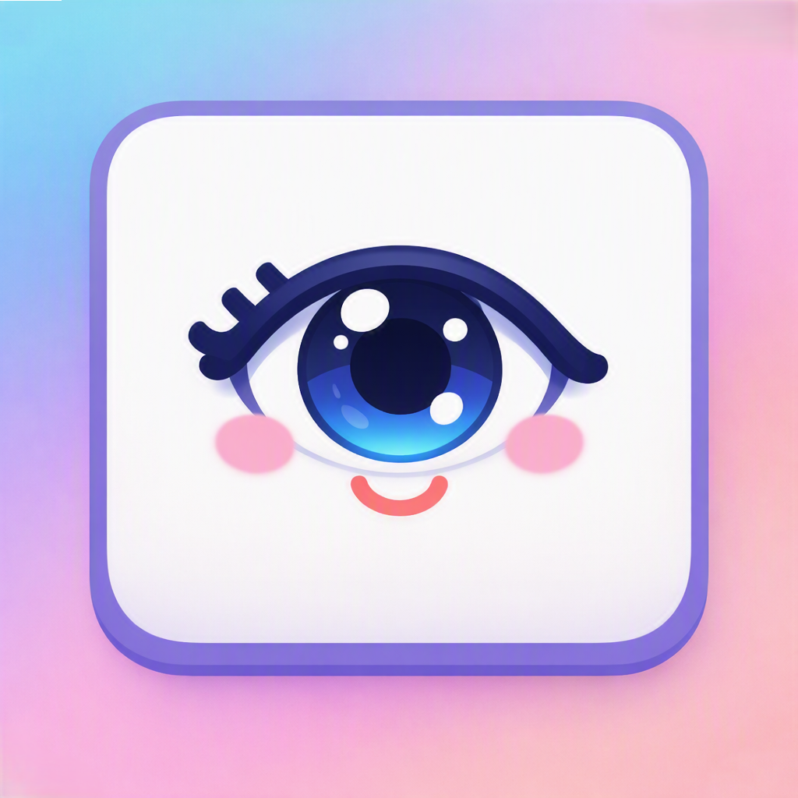

  

# Rest Your Eyes

[English](README.md) | [Español](README.es.md)

---

### 1. Project Description
**Rest Your Eyes** is a native Android application designed to prevent eye strain caused by prolonged mobile device usage. It enforces the famous 20-20-20 rule: for every 20 minutes of screen time, you should look at an object 20 feet away for 20 seconds. 

The app runs quietly in the background using a foreground service. When it detects that you have been actively using your phone for the set time limit of continuous screen time (resetting the timer if the screen turns off), it overlays a reminder screen to gently force you to take a break, featuring customizable sound alerts and auto-dismiss options.

### 2. Technologies Used
- **Language:** Kotlin
- **UI Framework:** Jetpack Compose (Material Design 3)
- **Data Persistence:** Jetpack DataStore (Preferences)
- **Architecture:** MVVM (Model-View-ViewModel)
- **Android APIs:** 
  - Foreground Services
  - Broadcast Receivers (`ACTION_SCREEN_ON`/`OFF`)
  - WindowManager (`SYSTEM_ALERT_WINDOW` / Overlays)

### 3. Key Learnings
Building this project taught me how to create a simple yet effective Android application capable of accurately tracking real device usage (continuous screen-on time) and actively displaying system-level overlay notifications based on that usage to help users build healthier digital habits.

### 4. Product Page
You can view the official landing page for the project here:
👉 [https://rest-your-eyes.ana-catalina.com](https://rest-your-eyes.ana-catalina.com)

### 5. Local Setup Instructions
To run this project locally on your machine:
1. Clone this repository.
2. Open the project in **Android Studio**.
3. Let Gradle sync and resolve all dependencies.
4. Run the app on an emulator or a physical device (minimum API level 26).
5. Grant the necessary permissions (Notifications and Display over other apps) when prompted.

---

---

## License

This project is licensed under the MIT License. See [LICENSE](LICENSE) for details.

