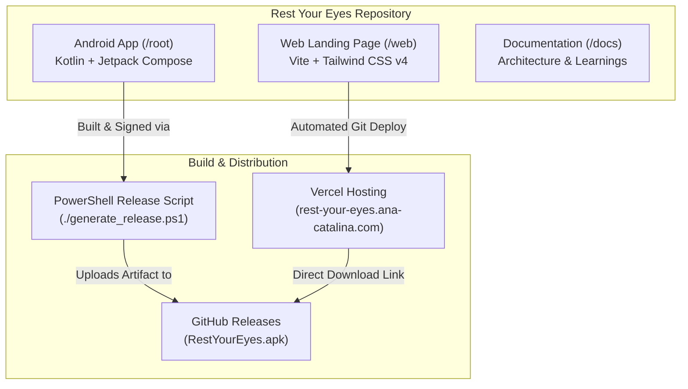
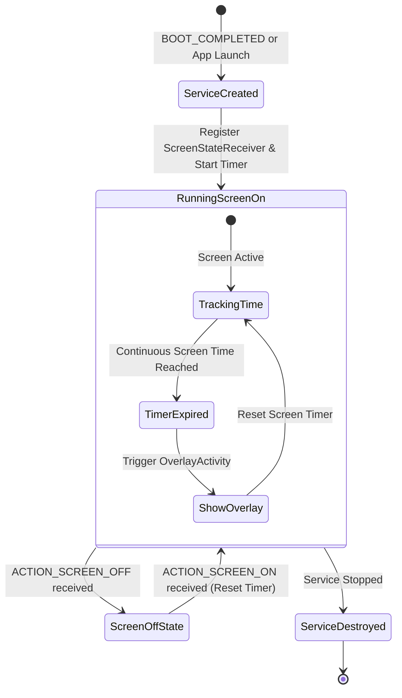
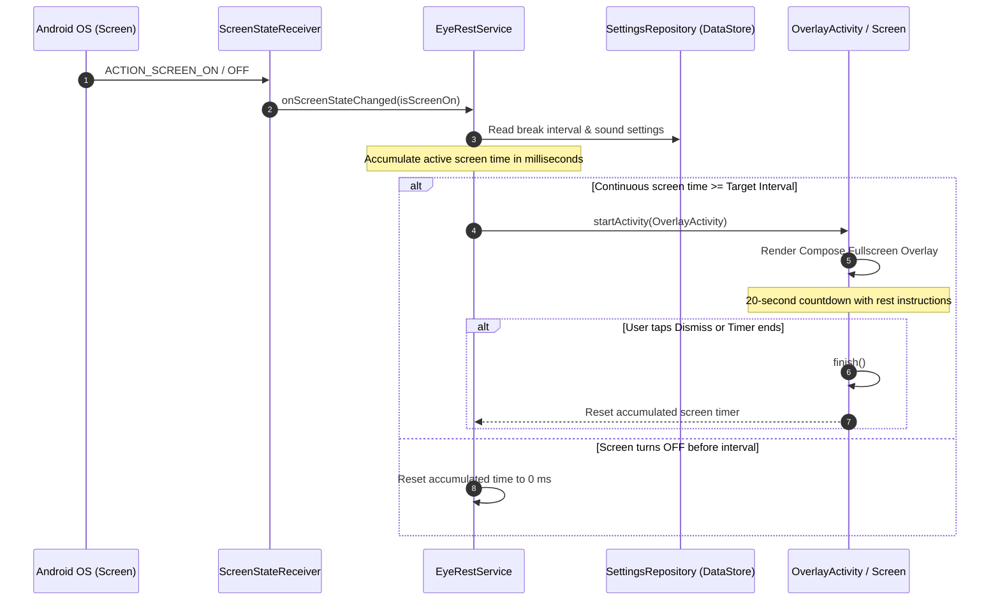

# System Architecture

## Project Overview (Monorepo)
The **Rest Your Eyes** project is organized as a monorepo containing both the Android native application and its promotional web landing page.

---

## Directory Layout
- **`/` (Root):** Contains the Android application source code, Gradle configurations, and the release generation automation script.
- **`/web`:** Contains the landing page source code (Vite, Tailwind CSS v4, HTML/JS).
- **`/docs`:** Contains system architecture documentation, external references, and technical learnings (ADRs).

---

## Android App Architecture & Core Flows

The Android application implements a reactive MVVM pattern backed by Jetpack DataStore and a background `ForegroundService` to track continuous screen usage.

### 1. Service Lifecycle & Screen State Tracking

The `EyeRestService` listens to screen state changes dynamically using `ScreenStateReceiver` (`ACTION_SCREEN_ON` and `ACTION_SCREEN_OFF`).

### 2. Overlay Display and Dismissal Flow

When active screen time reaches the configured break interval (e.g. 20 minutes), the service triggers `OverlayActivity` over all other apps.

---

## Data Persistence & Settings
- App preferences (break interval, sound alert enabled, vibration) are stored using **Jetpack DataStore (Preferences)**.
- Coroutine Flows (`Kotlin Flow`) expose live setting updates to both `MainViewModel` (for UI customization) and `EyeRestService` (for background scheduling).

---

## Production Build & Distribution Flow
1. **Keystore Management:** Keystore credentials and keystore properties are maintained locally using PowerShell automation (`./generate_release.ps1`).
2. **Release Artifacts:** Built release APKs are placed inside `releases/RestYourEyes.apk`.
3. **Web Distribution:** The web landing page links directly to the latest GitHub release artifact, keeping app distribution synchronized without frontend re-deployments.
